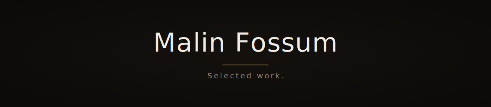

# Malin Fossum — Portfolio

Selected web development work. Minimal, dark-mode-first, built for accessibility.

Currently featuring coursework from GET Academy.

→ https://malinfossum.github.io/portfolio/

---

## Tech

HTML, CSS. Semantic markup, no frameworks, no build tools.

---

## Open source

[**template**](https://github.com/malinfossum/template) — Reusable web project starter. Three scaffolds, shared design system, dark-mode-first, mobile-first, accessible by default.

---

## Contact

- GitHub: https://github.com/malinfossum
- LinkedIn: https://linkedin.com/in/malinfossum
- Email: malinfossum.dev@proton.me
