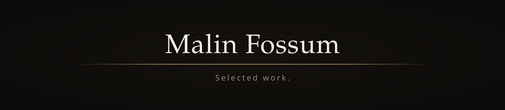

# Malin Fossum — Portfolio



A single-page portfolio of my web and desktop work. Dark-mode-first, accessible, and hand-written: no frameworks, no build step.

**Live:** https://malinfossum.github.io/portfolio/

## Selected projects

- [**varde**](https://github.com/malinfossum/varde) — A bilingual directory of Norwegian social services, with contact details verified against official sources. ASP.NET Core, PostgreSQL, React. [Live site](https://ambitious-flower-09612f00f.6.azurestaticapps.net)
- [**hugin**](https://github.com/malinfossum/hugin) — A job radar for the Norwegian developer market: public registries in, an outreach pipeline out. C#, EF Core, React. [Live demo](https://hugin-demo.azurewebsites.net)
- [**workbench**](https://github.com/malinfossum/workbench) — One canonical workbench: shared design system, copy-to-start scaffolds for web and C#, and a versioned extract tool.
- [**munin**](https://github.com/malinfossum/munin) — Local semantic search over your AI memory files: recall by meaning, cited by source. No server, no API keys, no telemetry.
- [**ember-black**](https://github.com/malinfossum/ember-black) — An OLED-first VS Code theme with warm accents and a distinct hue per token category.

The full list lives on the site.

## Structure

```
index.html      markup and content
src/styles/     stylesheet
assets/         banner, social image, favicon
```

## Running it locally

Clone the repository and open `index.html`, or serve the folder:

```bash
npx serve .
```

## License

MIT — see [LICENSE.txt](LICENSE.txt).

## Contact

- GitHub: https://github.com/malinfossum
- LinkedIn: https://linkedin.com/in/malinfossum
